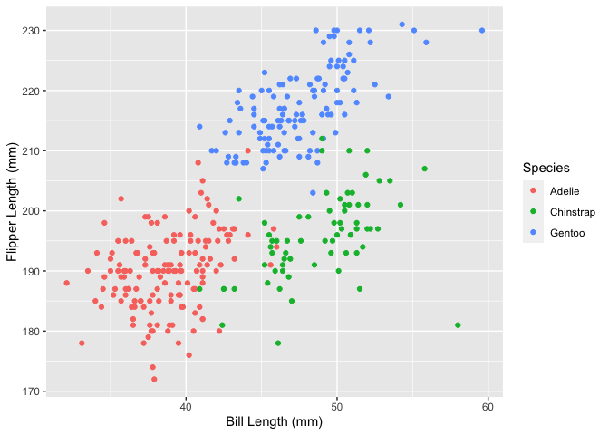

p8105_hw1_af3341
================
2022-09-16

## Problem 1

``` r
data("penguins", package = "palmerpenguins")
```

*Description*: The penguins dataset contains 344 observations of
penguins from the species Adelie, Gentoo, and Chinstrap. Some of the 8
variables include the islands the penguins are from (Biscoe, Dream,
Torgersen), as well as different physiological measurements. For
example, the flipper length was measured and the mean length was found
to be 201 mm.

    ## Warning: Removed 2 rows containing missing values (geom_point).

<!-- -->

    ## Saving 7 x 5 in image

    ## Warning: Removed 2 rows containing missing values (geom_point).
